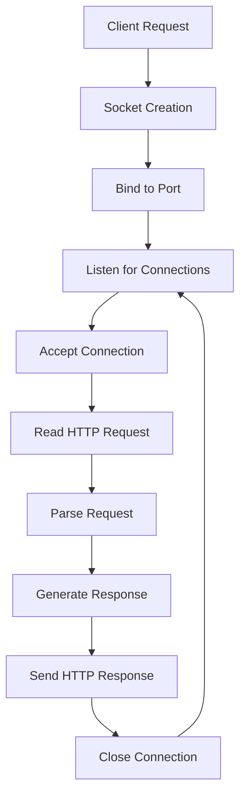

# 🌐 Simple C Web Server

[](https://opensource.org/licenses/MIT)
[](https://github.com)
[](https://en.wikipedia.org/wiki/C_(programming_language))

A minimal, educational web server implementation in C designed to demonstrate fundamental networking concepts and HTTP protocol handling.

## 🚨 Important Disclaimer

**⚠️ WARNING: This is an educational project!**
- **NOT PRODUCTION-READY**
- **NOT SECURE**
- **NOT OPTIMIZED**
- Use for learning purposes only

## 📖 What I Learned

Building this server provided hands-on experience with:

### 🔧 System Programming
- **Socket Programming**: Creating, binding, and managing network sockets
- **File Descriptors**: Understanding Unix file descriptors for network communication
- **System Calls**: Working with `socket()`, `bind()`, `listen()`, `accept()`
- **Network Byte Order**: Using `htons()`, `ntohs()` for proper data representation

### 🌐 Network Protocols
- **HTTP/1.1 Basics**: Request/response cycle and header formatting
- **TCP/IP Fundamentals**: Connection-oriented communication
- **Client-Server Architecture**: Handling multiple connections sequentially

### 🛠️ C Programming
- **Memory Management**: Proper buffer handling and string manipulation
- **Error Handling**: Using `errno` and `perror()` for system call errors
- **Structures**: Working with `struct sockaddr_in` for address management
- **Header Files**: Understanding which headers provide which functions

### 🔍 Debugging & Analysis
- **Network Debugging**: Using `netstat`, `curl`, and browser developer tools
- **Process Monitoring**: Tracking file descriptors and network connections
- **Protocol Analysis**: Examining raw HTTP traffic

## 🏗️ Architecture Overview



## 📦 Project Structure

```
simple_server_in_c/
├── cmd/
│   ├── server.c
│   ├── server.h
├── static/
│   └── index.html          # html we are sending to the user
├── Makefile                 # Build configuration
├── main.c                   # Server entry point
├── LICENSE                  # MIT License
└── README.md               # This file
```

## 🚀 Getting Started

### Prerequisites
- GCC compiler
- Linux/Unix environment
- Basic understanding of C and networking

### Compilation
```bash
# Clone the repository
git clone https://github.com/walonCode/simple_server_in_c.git
cd simple_server_in_c

# Compile the server
make run

# Or compile manually
gcc -o main main.c ./cmd/server.c ./cmd/server.h
```

### Running the Server
```bash
# Start the server on port 8080
./main

# Test with curl
curl http://localhost:8080

# Test in browser
# Navigate to: http://localhost:8080
```

## 🔧 How It Works

### 1. Socket Creation
```c
int server_fd = socket(AF_INET, SOCK_STREAM, 0);
```
Creates an endpoint for TCP communication.

### 2. Address Binding
```c
struct sockaddr_in address = {
    .sin_family = AF_INET,
    .sin_port = htons(8080),
    .sin_addr.s_addr = INADDR_ANY
};
bind(server_fd, (struct sockaddr*)&address, sizeof(address));
```
Binds the socket to all network interfaces on port 8080.

### 3. Connection Handling
```c
while (1) {
    int client_socket = accept(server_fd, NULL, NULL);
    handle_request(client_socket);
    close(client_socket);
}
```
Accepts connections and handles each request sequentially.

## 🧪 Testing Your Server

### Basic HTTP Test
```bash
curl -v http://localhost:8080
```

### Stress Testing (Not Recommended!)
```bash
# Don't do this in production!
for i in {1..100}; do
    curl http://localhost:8080 &
done
```

## ⚠️ Limitations & Security Concerns

### 🚫 Critical Limitations
- **Single-threaded**: Handles one request at a time
- **No Request Parsing**: Only handles simple GET requests
- **No HTTP Headers**: Ignores most HTTP headers
- **Hard-coded Responses**: Always returns "Hello, World!"
- **No Error Handling**: Minimal error recovery
- **No Logging**: No request logging or monitoring

### 🔒 Security Issues
- **Buffer Overflow Risk**: Fixed-size buffers with no bounds checking
- **No Input Validation**: Accepts any input without sanitization
- **No Resource Limits**: Potential for resource exhaustion
- **No SSL/TLS**: Plain HTTP only
- **No Authentication**: Completely open access

## 🎯 Educational Value

This project demonstrates:

### Core Concepts Understood
- **Network Stack**: How applications use the transport layer
- **Protocol Design**: Basics of request-response protocols
- **Concurrency**: Why sequential handling is problematic
- **Resource Management**: File descriptor lifecycle

### Real-World Comparisons
| Concept | This Server | Production Server |
|---------|-------------|-------------------|
| Concurrency | Sequential | Multi-threaded/Async |
| Security | None | Input validation, SSL, auth |
| Performance | Basic | Optimized I/O, caching |
| Features | Hello World | Routing, templates, APIs |

## 🔄 Next Steps for Improvement

If this were to be enhanced, consider:

### Immediate Improvements
1. Add proper HTTP parsing
2. Implement basic routing
3. Add error handling
4. Include request logging

### Advanced Features
1. Multi-threading with `pthread`
2. Non-blocking I/O with `select()`/`poll()`
3. CGI support for dynamic content
4. Virtual host support

### Production Considerations
1. Implement SSL/TLS
2. Add authentication
3. Request rate limiting
4. Comprehensive logging

## 🤝 Contributing

This is primarily an educational project, but suggestions are welcome! Please remember this is a learning exercise, not production code.

## 📚 Further Learning

### Recommended Resources
- **Books**: "Unix Network Programming" by W. Richard Stevens
- **RFCs**: RFC 7230 (HTTP/1.1 Specification)
- **Tools**: Wireshark for network analysis
- **Projects**: nginx, Apache httpd source code

### Related Concepts to Explore
- HTTP/2 and HTTP/3 protocols
- WebSocket connections
- Reverse proxy setups
- Load balancing techniques

## 📄 License

This project is licensed under the MIT License - see the [LICENSE](LICENSE) file for details.

---

**Remember**: This server is like a bicycle with training wheels - great for learning, but you wouldn't enter the Tour de France with it! 🚴‍♂️

*Built with curiosity and a lot of `man` page reading* 📖
